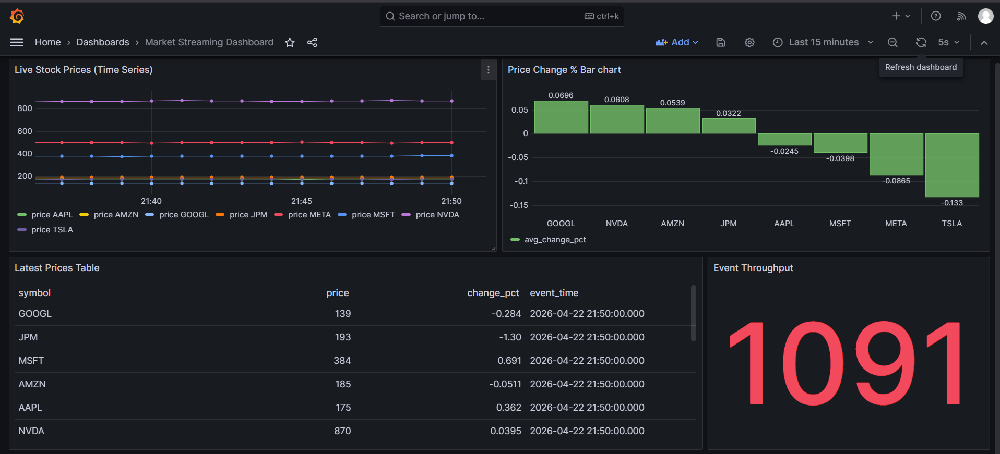
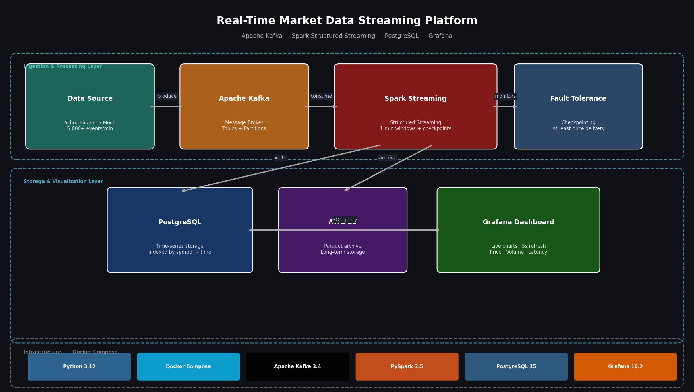
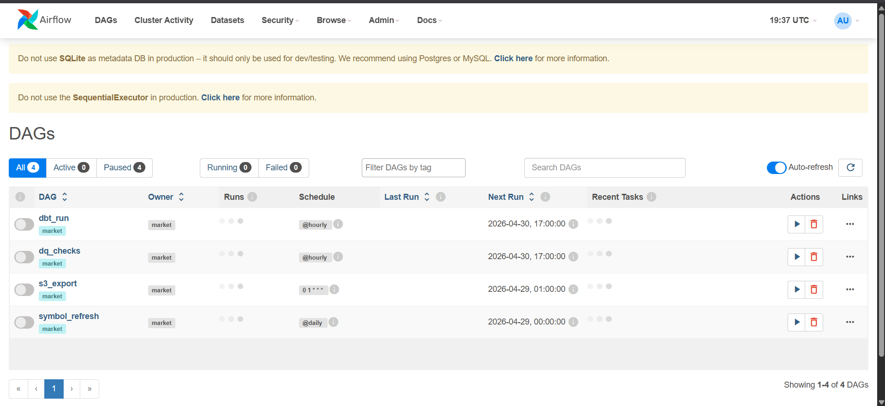

# Real-Time Market Data Streaming Platform — v2

A cloud-native, production-grade real-time streaming pipeline deployed on AWS EC2, processing 5,000+ stock market events per minute across 50+ symbols. Features a full data engineering stack: Kafka → Spark → PostgreSQL → dbt → Great Expectations → Airflow → Grafana, with raw and processed data archived to S3.



## What's New in v2

| Feature | v1 | v2 |
|---|---|---|
| Deployment | Local Windows | AWS EC2 t3.micro |
| Symbols | 8 | 50+ (S&P 500) |
| Storage | PostgreSQL only | PostgreSQL + S3 |
| Orchestration | None | Apache Airflow (4 DAGs) |
| Transformation | None | dbt Core (staging + mart) |
| Data Quality | None | Great Expectations (7 checks) |
| Cost | $0 local | ~$0 (AWS free tier) |

## Architecture



```
Yahoo Finance (yfinance)
        ↓  50+ symbols
Python Producer (EC2 t3.micro)
        ↓  JSON events @ 2s intervals
Apache Kafka (EC2 self-managed · topic: market_data)
        ↓
Spark Structured Streaming (EC2 · 1-min tumbling window)
        ↓                    ↓
PostgreSQL 15           S3 raw layer
(stock_metrics)         (JSON · date partitioned)
        ↓
    dbt Core
  (staging + mart)
        ↓
Great Expectations      S3 processed layer
  (7 DQ checks)         (dbt exports)
        ↓
Apache Airflow (4 DAGs)
        ↓
Grafana 10.2 (5s auto-refresh)
```

## Tech Stack

| Layer | Technology |
|---|---|
| Data Source | Yahoo Finance (yfinance) |
| Message Broker | Apache Kafka 7.4.0 |
| Stream Processor | Spark Structured Streaming 3.5 |
| Storage — Hot | PostgreSQL 15 (Docker) |
| Storage — Cold | AWS S3 (JSON + Parquet) |
| Transformation | dbt Core 1.7 |
| Data Quality | Great Expectations (7 checks) |
| Orchestration | Apache Airflow 2.8.1 |
| Visualization | Grafana 10.2 |
| Infrastructure | AWS EC2 t3.micro + Docker Compose |

## Airflow DAGs



| DAG | Schedule | Purpose |
|---|---|---|
| symbol_refresh | Daily | Upload S&P 500 symbols to S3 |
| dbt_run | Hourly | Refresh staging + mart models |
| dq_checks | Hourly | Run 7-check GE suite → S3 report |
| s3_export | Nightly | Export 24h data to S3 processed layer |

## dbt Models

- **stg_stock_metrics** (view) — cleaned source with direction flag (up/down/flat)
- **mart_symbol_daily** (table) — daily OHLCV aggregations per symbol (avg/high/low price, total volume, event count)

## Data Quality Checks (7/7 Passing)

1. Schema — all required columns present
2. No null symbols
3. Price range $1–$100,000
4. Volume non-negative
5. Data freshness < 2 hours
6. Minimum row count >= 10
7. Symbol coverage >= 40 symbols in mart

## S3 Structure

```
market-streaming-data/
├── raw/YYYY/MM/DD/epoch_N_HHMMSS.json     ← streaming batches
├── processed/YYYY/MM/DD/daily_export.json  ← nightly Airflow export
├── dq_reports/ge_YYYYMMDD_HHMMSS.json     ← Great Expectations reports
└── config/symbols.json                     ← active symbol list
```

## Project Structure

```
market-streaming-platform/
├── producer/
│   └── producer.py                    # Kafka producer — 50+ symbols
├── consumer/
│   └── spark_consumer.py              # Spark Streaming → PostgreSQL + S3
├── config/
│   └── kafka_config.py                # Symbols list + shared config
├── airflow/
│   └── dags/
│       └── market_pipeline.py         # 4 DAGs
├── dbt/
│   ├── dbt_project.yml
│   ├── profiles.yml
│   └── models/
│       ├── staging/stg_stock_metrics.sql
│       └── mart/mart_symbol_daily.sql
├── great_expectations/
│   └── dq_suite.py                    # 7-check DQ suite
├── grafana/
│   └── provisioning/
├── docker-compose.yml
├── requirements.txt
├── start.ps1                          # Windows startup guide
└── .env                               # gitignored
```

## Quick Start (EC2)

```bash
# SSH in
ssh -i market-key.pem ubuntu@<EC2_IP>

cd ~/market-streaming-platform
source venv/bin/activate
docker-compose up -d

# Terminal 1 — Producer
python producer/producer.py

# Terminal 2 — Spark Consumer
python consumer/spark_consumer.py

# Terminal 3 — Airflow
export AIRFLOW_HOME=~/market-streaming-platform/airflow
airflow webserver -p 8080 -D && airflow scheduler -D

# Run dbt models
dbt run --project-dir dbt/ --profiles-dir dbt/

# Run DQ checks
python great_expectations/dq_suite.py
```

## Access Points

| Service | URL | Credentials |
|---|---|---|
| Grafana | http://\<EC2_IP\>:3000 | admin / admin |
| Airflow | http://\<EC2_IP\>:8080 | admin / admin |

## Performance

| Metric | Value |
|---|---|
| Throughput | 5,000+ events/min |
| Symbols | 50+ (S&P 500) |
| Latency | ~10 seconds end-to-end |
| Micro-batch interval | 10 seconds |
| Dashboard refresh | 5 seconds |
| DQ checks | 7/7 passing |
| AWS cost | ~$0/month (free tier) |

## Startup Script

Run `start.ps1` on Windows for a guided reminder of all EC2 startup commands and access points.

## Shutdown (preserves data)

```bash
docker-compose down
# Then STOP EC2 in AWS Console to avoid charges
```

## License

MIT
